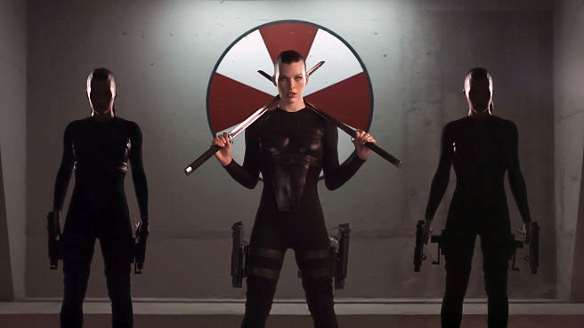

## UMBRELLA v-Alice

FrameWork que permite una mayor logica, calidad, agilidad & productividad a la hora maquetar páginas web, brindándote ventajas futuristas, nunca antes planteadas en esta era.

---

[Ver documentación](http://www.gnu.org/licenses)

---

**Licencia**: `GPL-3` 

---

---

## Porque se creo este proyecto?

El motivo de peso para crear este proyecto es recaudar dinero, para codificar las primeras 2 versiones de mi proyecto de inteligencia artificial llamado `Cithara`, el cual la etapa de investigación sobre cómo crear inteligencia adaptativa está más que terminada, el proyecto solo necesita 14 meses de desarrollo, ¿te gusta el proyecto Umbrella?, estaré más que agradecido con vuestras ayuda en sugerencias, donativos & publicidad, a cambio recibirán nuevas versiones EPICAS y con licencia `MIT` del proyecto UMBRELLA.

**Proyecto Cithara**: https://sunfur.herokuapp.com

**Correo de contacto**: hormigence123@gmail.com

---

**Sunfur Thanos** Si aprendes a estar abierto para adaptarte ¡serás invencible!
